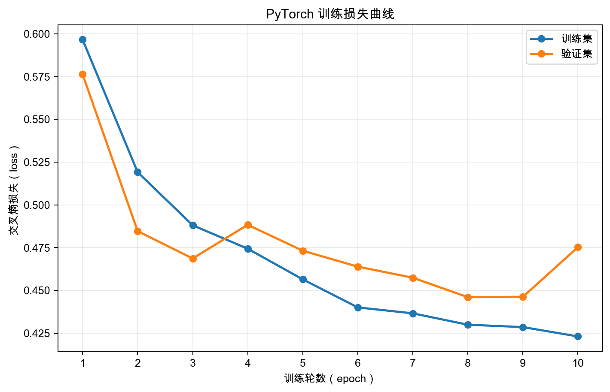

# 猫狗分类器

这是我学习卷积神经网络时做的猫狗分类项目，包括 NumPy 手写版和 PyTorch 版。

## 目录

```text
implementations/
├── numpy_baseline/    NumPy 手写版
└── pytorch/           PyTorch 版
notebooks/             Notebook 学习记录
docs/                  结构和实验记录
data/                  本地数据集
outputs/               模型与测试结果
```

模型结构、参数选择和实验结果写在 [architecture.md](docs/architecture.md) 中。

## 数据

数据来自 [Kaggle Dogs vs. Cats](https://www.kaggle.com/datasets/princelv84/dogsvscats)。图片没有提交到仓库，目录格式见 [data/README.md](data/README.md)。

## 运行

NumPy 手写版：

```bash
python3 -m pip install -r implementations/numpy_baseline/requirements.txt
python3 implementations/numpy_baseline/smoke_test.py
python3 implementations/numpy_baseline/train.py
python3 implementations/numpy_baseline/evaluate.py
```

PyTorch 版：

```bash
python3 -m pip install -r implementations/pytorch/requirements.txt
python3 implementations/pytorch/train.py --device mps
python3 implementations/pytorch/evaluate.py --device mps
```

## 结果

| 代码 | 最佳验证准确率 | 测试准确率 |
| --- | ---: | ---: |
| NumPy 手写版 | 76.80% | 76.24% |
| PyTorch 版 | 80.58% | 80.48% |

## PyTorch 训练曲线



曲线数据保存在 `outputs/pytorch/training_history.json`。

## Notebook

PyTorch Notebook 在 [notebooks/cat_dog_classifier_workflow.ipynb](notebooks/cat_dog_classifier_workflow.ipynb)，其中包含数据样本、特征图、训练曲线、混淆矩阵、误判样本和卷积核可视化。

```bash
jupyter notebook notebooks/cat_dog_classifier_workflow.ipynb
```
